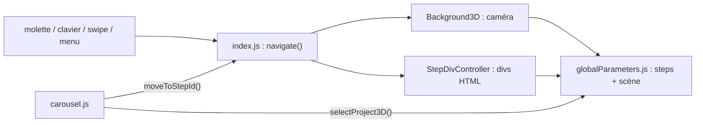

# Architecture

## Vue d'ensemble

Tout le contenu est écrit en dur dans `index.html`. Le JavaScript ne génère presque rien : il affiche une section à la fois, anime les transitions et pilote le fond 3D. Si WebGL est indisponible, le fond 3D est désactivé et le reste du site fonctionne normalement.



## La notion de step

Une **step** est un écran du site. Elles sont toutes déclarées dans `globalParameters.steps` (`src/globalParameters.js`), une `Map` id → `Step` :

| Champ | Rôle |
|---|---|
| `divId` | id de la `div.root_step` correspondante dans `index.html` |
| `cameraPosition`, `cameraTarget` | point de vue de la caméra 3D pour cette step |
| `nextStepId`, `previousStepId` | voisines pour la molette, le clavier et le swipe (absentes sur les pages de détail) |
| `init`, `onFocus`, `onLeave`, `tick` | callbacks 3D optionnels, qui reçoivent la step en argument |

Il y a trois steps principales chaînées (`home` → `projects` → `about`) et une step par page de détail (`galeri3`, `souk`…). Les pages de détail partagent le même point de vue caméra et n'ont pas de voisines : on y entre depuis un carrousel et on en sort par le bouton retour ou le menu.

**L'ordre de déclaration dans la `Map` compte** : aller vers une step déclarée plus loin fait glisser l'écran vers le haut, vers une step déclarée avant, vers le bas.

## Modules

| Fichier | Rôle |
|---|---|
| `src/index.js` | Point d'entrée (`window.onload`). Crée le fond 3D (optionnel), masque l'écran de chargement, branche la navigation (molette, clavier, swipe, menu), initialise les deux carrousels. |
| `src/globalParameters.js` | Déclaration des steps et construction de la scène (`globalInit`) : 3 plateformes, leurs spots, et les 6 cubes des projets pro qui tournent pour mettre le projet sélectionné face à la caméra. |
| `src/Background3D.js` | Renderer three.js, boucle de rendu à 30 fps max (le fps baisse si les frames sont lentes), interpolation de la caméra entre deux steps. Mode debug : `OrbitControls` + inspecteur. |
| `src/StepDivController.js` | Transitions HTML entre deux steps (voir ci-dessous). Met en pause les vidéos et sons au changement de step. |
| `src/carousel.js` | Carrousels : sélection d'un item avec glissement de l'aperçu, sélection automatique toutes les 8 s (en pause au survol, quand la section est cachée ou quand l'onglet est en arrière-plan), bouton « Plus d'informations », en-tête (image + bouton retour) ajouté à chaque page de détail. |
| `src/utils.js` | Fonctions pures, testées : easing, `wheelDirection`, `keyDirection`, `swipeDirection`, `isMobileUserAgent`, `playAnimation`. |

## Navigation

1. Une entrée (molette, flèches ou PageUp/PageDown, swipe vertical, bouton) donne une direction ou un id de step.
2. `navigate()` (`src/index.js`) applique le même déplacement au `Background3D` et au `StepDivController`. **Rien ne bouge tant que l'un des deux est en mouvement** (`isMoving`) : c'est ce qui les garde synchronisés.
3. À la fin de la transition HTML, le bouton du menu correspondant est souligné.

### Transitions HTML

`index.html` contient deux conteneurs plein écran :

- `#on_screen` contient toutes les `div.root_step`, masquées par la classe `hidden` sauf celle de la step courante ;
- `#off_screen` est vide et masqué au repos.

Pendant une transition, la step qui part est déplacée dans `#off_screen`, la nouvelle est affichée dans `#on_screen`, et les deux conteneurs jouent une animation CSS (`up_on_screen` / `up_off_screen` ou `down_…`, dans `style.css`). À la fin, la step partie retourne dans `#on_screen`, masquée.

Les animations CSS passent par `playAnimation` (`src/utils.js`), qui résout sa promesse sur `animationend`, sur `animationcancel`, ou après un délai de sécurité. Sans ce délai, une animation interrompue laisserait la navigation bloquée.

Les carrousels utilisent le même principe à plus petite échelle : `<carousel>_carousel_preview_on_screen` / `_off_screen`, animations `move_carousel_preview_*`.

## Ajouter un projet à un carrousel

Un même identifiant (ici `mon_projet`, en snake_case) relie **5 endroits**. Les tests d'intégrité (`tests/site-integrity.test.js`) vérifient leur cohérence.

1. **`src/globalParameters.js`** : ajouter `"mon_projet"` à `detailStepIds` (l'ordre fixe le sens des transitions).
2. **`index.html`, carrousel** : un item dans `.carousel_item_container` :

   ```html
   <button
     type="button"
     id="mon_projet_item"
     title="mon projet"
     class="carousel_item"
     style="background-image: url(./assets/img/carousel/projects/mon_projet.png)"
   ></button>
   ```

3. **`index.html`, aperçu** : dans `#projects_carousel_preview_on_screen` :

   ```html
   <div id="mon_projet_preview_content" class="carousel_preview_content hidden">
     <h2>Mon projet</h2>
     <p>description courte<br />(dates)</p>
     <br />
     <button type="button" class="custom_button">Plus d'informations</button>
   </div>
   ```

4. **`index.html`, page de détail** : dans `#on_screen` :

   ```html
   <div id="mon_projet_step" class="root_step hidden">
     <div class="step_content">…</div>
   </div>
   ```

5. **Image** : `assets/img/carousel/projects/mon_projet.png` (vignette, aperçu et en-tête de la page de détail). Pour le carrousel « créations personnelles », remplacer `projects` par `about` partout.

Pour les médias de la page de détail : `loading="lazy"` sur les `` et `<iframe>`, `preload="none"` sur `<audio>`/`<video>`, un `alt` sur chaque image et un `title` sur chaque iframe (vérifiés par les tests).

Dans le carrousel des projets pro, chaque projet a aussi un cube 3D : ajouter l'id et une couleur dans `projectMeshColors` (`src/globalParameters.js`). Sans cela, la sélection du projet n'a simplement pas d'effet 3D.

## Fallback sans WebGL

`createBackground3D()` (`src/index.js`) attrape toute erreur de création ou de chargement du fond 3D et renvoie `null`. La navigation utilise alors uniquement le `StepDivController`, et les carrousels ignorent la partie 3D (`selectProject3D?.()`).

## Mode debug 3D

Passer `window.DEBUG_3D = true` dans `src/index.js` puis lancer `npm run dev` :

- caméra libre (`OrbitControls`) ; la touche `a` l'active ou la désactive ;
- à chaque touche relâchée, les coordonnées `cameraPosition` / `cameraTarget` courantes sont copiées dans le presse-papier, prêtes à coller dans une step ;
- inspecteur de scène (`three-inspect`, chargé à la demande dans un chunk séparé) ;
- la molette ne change plus de step et les divs laissent passer la souris.

Ne pas commiter avec `DEBUG_3D = true`.

## Tests

`npm test` (Vitest + jsdom) :

| Fichier | Couvre |
|---|---|
| `tests/site-integrity.test.js` | cohérence steps ↔ HTML ↔ assets, fichiers référencés existants, accessibilité (`lang`, `alt`, `title`, boutons) |
| `tests/StepDivController.test.js` | transitions, verrou `isMoving`, cas limites |
| `tests/carousel.test.js` | sélection, sens du glissement, pages de détail, sélection automatique et pause |
| `tests/utils.test.js` | fonctions pures |
| `tests/build.test.js` | le build de production est identique à `dist/bundle.js` |

jsdom ne joue pas les animations CSS : les tests déclenchent la fin à la main avec `element.onanimationend()`. WebGL n'est pas disponible sous jsdom, donc `Background3D` n'est pas testé unitairement : on le vérifie dans un navigateur.
